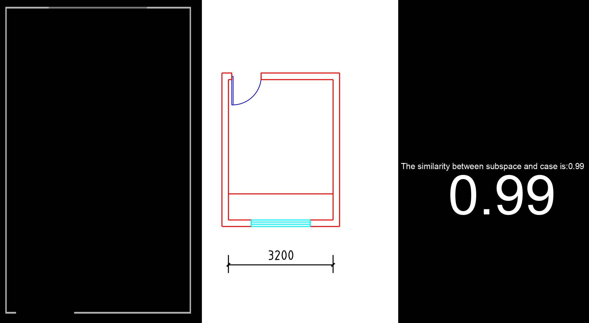

# Automated Subspace Matching for Residential Floor Plans using Deep Learning: Enhancing Interior Design Efficiency
[](https://doi.org/10.5281/zenodo.15023446)

This repository contains code for an automated method to extract the data structure of subspaces of residential floor plans and compare it with case data.

## Installation

The recognition of residential floor plans is based on [PaddleSeg](https://github.com/PaddlePaddle/PaddleSeg),[PaddleDetection](https://github.com/PaddlePaddle/PaddleDetection),[PaddleOCR](https://github.com/PaddlePaddle/PaddleOCR). We have modified PaddleSeg and PaddleDetection. Please get the corresponding code from the link below.

[PaddleSegOpen](https://drive.google.com/file/d/1UbupzlBGgB_4KcTvQxSFanW_MLzYvQly/view?usp=sharing)

[PaddleDetectionOpen](https://drive.google.com/file/d/1-0FKlOIkDsipcTrwIBAZ5ZCmaZXtsxGV/view?usp=sharing)

(1) Install all dependencies, first the paddlepaddle 2.5 version

```
python3 -m pip install paddlepaddle-gpu==2.5.2.post120
-f https://www.paddlepaddle.org.cn/whl/linux/mkl/avx/stable.html
```

(2) Install three dependent frameworks, PaddleSeg, PaddleDetection, PaddleOCR (PaddleSegOpen and PaddleDetectionOpen have been downloaded)

```
cd PaddleSegOpen
pip install -r requirements.txt
pip install -v -e .

cd PaddleDetectionOpen
pip install -r requirements.txt
pip install -v -e .

pip install "paddleocr==2.7.0" -i https://pypi.tuna.tsinghua.edu.cn/simple
```

## Example Usages

The **DataSet** can be obtained from the following [link](https://drive.google.com/file/d/1VRuwxMojBlhNG2eimeITnEubTW6fA91I/view?usp=sharing).

Train
You can train your own semantic segmentation model for floor plans.

```
cd PaddleSegOpen
python tools/train.py --config "FloorPlanOpendir/configs/floorplan16.yml" --do_eval --use_vdl --save_interval 200 --save_dir "Your_output_dir"

# Please note the modified path "FloorPlanOpendir" and the dataset path in the "floorplan16.yml" file
```

Infer
In addition to the semantic segmentation model, you can also obtain the [key area detection model](https://drive.google.com/file/d/1L9CjKt0afGOW406lJrbkZrluCKUcgEO0/view?usp=sharing) of the residential floor plan and [the semantic segmentation model](https://drive.google.com/file/d/1sz5nbhnKT_Wx6VgNCo795w0LsoCz0S_H/view?usp=sharing) of the case data. Please place the semantic segmentation model of floor plan, the semantic segmentation model of case diagram, and the key area detection model of floor plan in the dir "model/floorplanseg", "model/kuangseg" and  "model/detection" respectively. The semantic segmentation model of the floor plan needs to be renamed to "model16.pdparams".

The following subspace comparison results can be obtained through the following code:

```
python utils/Subspace_Match.py
```



